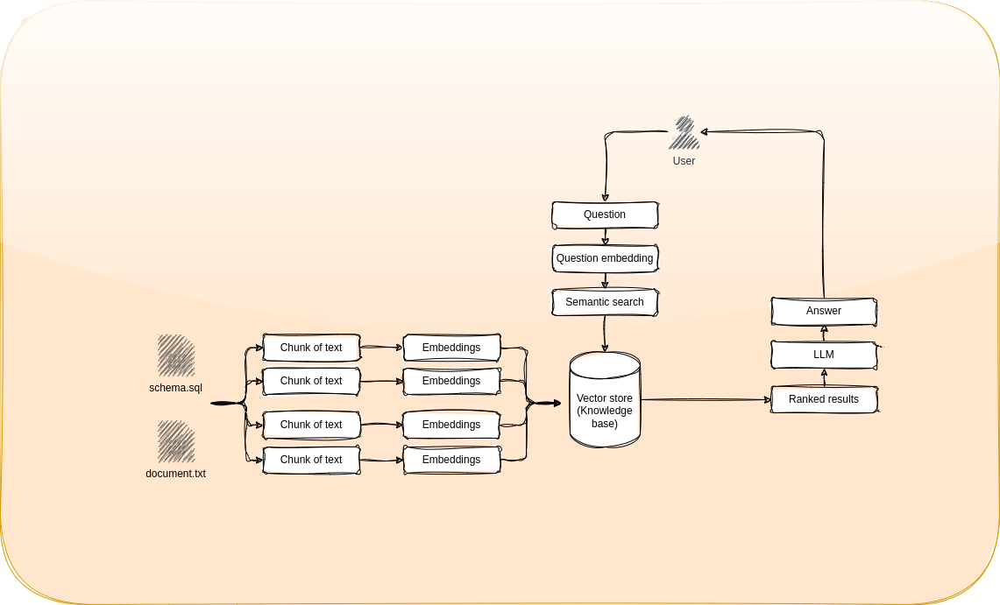

# LLM Data Talk

[output.webm](https://github.com/dmenezesgabriel/llm-data-talk/assets/50274255/e5410ca5-4bfa-4c44-a75e-0ea43bfd2865)

## How it works



## chinook database

(github)[https://github.com/lerocha/chinook-database/releases]

## Development

- **set python version**:

```sh
pyenv global 3.9.6
```

- **create virtual environment**:

```sh
pyenv exec python -m venv venv
```

- **install requirements**:

```sh
pip install -r requirements-dev.txt
```

- **run**:

```sh
PYTHONDONTWRITEBYTECODE=1 streamlit run main.py
```

- **execute modules separately**:

```sh
cd app
PYTHONDONTWRITEBYTECODE=1 python -m src.external.llm.langchain.chains.graph
```

## Localstack

- **Run localstack Bash**:

  ```sh
  docker compose up -d localstack && \
  docker compose exec localstack bash
  ```

- **Use awscli inside container**:

  ```sh
  aws --endpoint-url=http://127.0.0.1:4566 s3 ls
  ```

## Architecture


### Repositories

- [terraform-aws-data-lake](https://github.com/dmenezesgabriel/terraform-aws-data-lake)

## Resources

- [chat2plot](https://github.com/nyanp/chat2plot)
- [vizro-ai](https://github.com/mckinsey/vizro/tree/main/vizro-ai)
- [Enforce output with pydantic](https://xebia.com/blog/enforce-and-validate-llm-output-with-pydantic/)
- [Validating language models output](https://medium.com/@azizbenothman76/pydantic-and-prompt-engineering-the-essentials-for-validating-language-model-outputs-e48553eb4a3b)
- [streamlit + cognito + terraform](https://medium.com/@EKohlmeyer/deploying-a-streamlit-web-app-on-aws-with-authentication-using-aws-cognito-a-comprehensive-guide-1da9e7ae4726)
- [Q&A RAG Bot](https://medium.com/@muhammad2000ammar/building-a-q-a-chatbot-on-private-data-ba1af4a9a4dc)
- [Streamlit + nginx](https://discuss.streamlit.io/t/deploy-streamlit-with-nginx-docker/52907/2)
- [Streamlit + nginx](https://discuss.streamlit.io/t/deploy-streamlit-app-using-nginx/15493)
- [Lang Chain Router](https://python.langchain.com/docs/expression_language/cookbook/embedding_router)
- [named-entity-recognition](https://medium.com/@grisanti.isidoro/named-entity-recognition-with-llms-extract-conversation-metadata-94d5536178f2)
